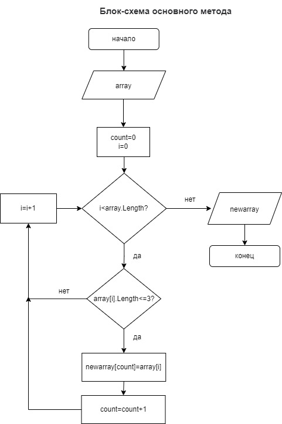

# Задача
Написать программу, которая из имеющегося массива строк формирует массив из строк, длина которых меньше либо равна 3 символа. 
Первоначальный массив можно ввести с клавиатуры, либо задать на старте выполнения алгоритма. 
При решение не рекомендуется пользоваться коллекциями, лучше обойтись исключительно массивами.

# Блок-схема алгоритма

# Описание решения:
1. В методе *Main*:
- задаем массив строк на старте выполнения алгоритма (длина массива 4 элемента);
- задаем новый массив для формирования нового массива строк по заданным условиям;  
- вводим переменную *count*;
- задаем цикл *for*, внутри которого проверка условия, если длина строк меньше либо равна 3 символа, элементы заданного массива записываются в новый массив;
2. Для ввывода на печать массивов заданы методы PrintArray1, PrintArray2.

